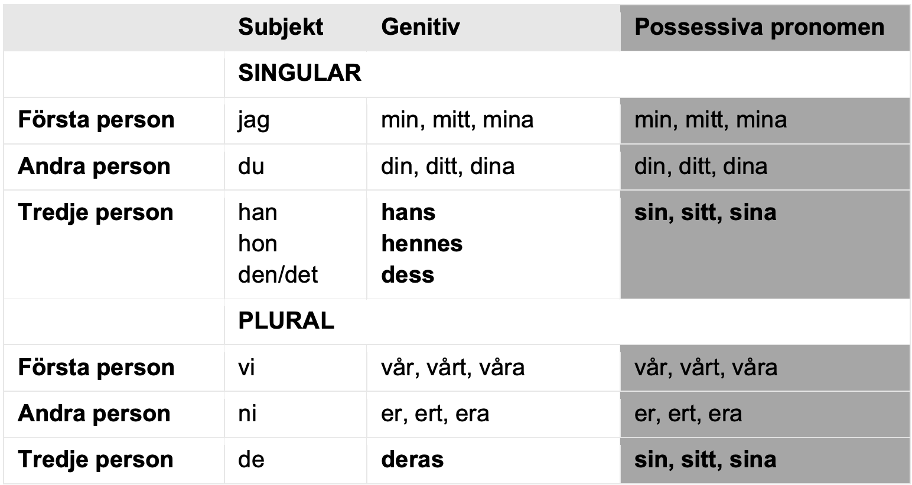

### Mjuka och Hårda vokaler (Soft & Hard Vowels)

|**A**|**O**|**U**|**Å**|
|-----|-----|-----|-----|

Eg: 
* Gammal (old)
* Gott (Tasty)
* Kul (Fun)
* Gå (walk)

|**E**|**I**|**Y**|**Ä**|**Ö**|
|-----|-----|-----|-----|-----|

Eg:
* Ge (Give)
* Kypare (Waiter)
* Gilla (Like)
* Kärlek (Love)
* Get (Goat)
* Köpa (Buy)

### PERSONLIGA PRONOMEN
| **Subjekt** | **Objekt-Form** |
| ----------- | --------------- |
| **Singular** |
| Jag (I) - ഞാൻ | Mig (Me) - എന്നെ |
| Du  (You - singular, informal) - നീ |  Dig (You - singular, informal) - നിനക്ക് |
| Han (He) - അവന്‍ | Honom (Him) - അവനെ |
| Hon (Her) - അവള്‍ | Henne (Her) - അവളെ |
| Hen | Hen |
| Den (It) - അത് | Den |
| Det (It) - അത് | Det |
| Man (ഒരുവന്‍) | En |
| **Plural** |
| Vi  (We)- ഞങ്ങള്‍ |  Oss (Us) - ഞങ്ങളെ |
| Ni  (You plural) - നിങ്ങൾ | Er (You - plural or formal singular) |
| De  (They) - അവര്‍ | Dem (Them) - അവരെ |

Notes:
* Hen is the gender-neutral pronouns
* Man is a general term referring to a person or someone

### PRONOMEN FÖR ÄGANDE

