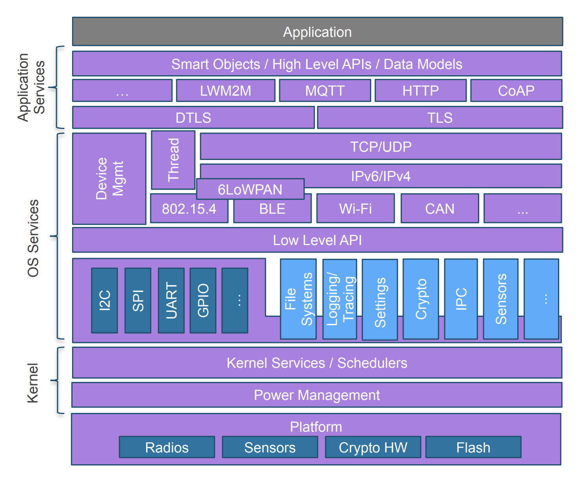

<!--  -->


## what is Zephyr?

Zephyr RTOS is a game-changing technology developed by experts with decades of collective experience in the embedded world. Originally created as Rocket by Wind River Systems in 2015 and later rebranded as Zephyr, this open-source project has gained immense popularity since its inception. As an open-source project, anyone can access the source code and understand its internal workings.

Over the years, Zephyr has garnered a lot of attention from major tech giants like Google, Meta, Intel, and many more, resulting in significant investments in the project. The depth of contributions by multiple companies can be seen in the commits. Zephyr is not just an RTOS; it's an ecosystem of a fully-fledged open-source project with strong foundations.

The project is developed, managed, and maintained in a transperant manner. Zephyr is heavily inspired by the Linux kernel and makes use of many other popular technologies. In this blog post, we'll delve into the details of Zephyr RTOS, exploring its features, benefits, and potential applications.

## Main features of Zephyr


* Open source
* Stable RTOS kernal with very low memmory footprint, suitable for both energy hungry and ultra lo power for IoT devices.
* Wide range of support for different cpu arictectures and platforms
* Stable releases and Long term support
* Good documentation
* Vibrant Community
* Modular architecture
* Test suit included
* Built with safety and security in mind
* Vendor Neutral, meaning it is not limited to any specific vendors or companies
* 3rd party libraries

## Architecture



## Getting started

Note: To build and flash the following sample, complete the installation instructions
at https://docs.zephyrproject.org/latest/develop/getting_started/index.html

main.c for a simple blinky program.

```c:title=app/src/main.c

#include <zephyr/kernel.h>
#include <zephyr/drivers/gpio.h>

/* 1000 msec = 1 sec */
#define SLEEP_TIME_MS   1000

/* The devicetree node identifier for the "led0" alias. */
#define LED0_NODE DT_ALIAS(led0)

/*
 * A build error on this line means your board is unsupported.
 * See the sample documentation for information on how to fix this.
 */
static const struct gpio_dt_spec led = GPIO_DT_SPEC_GET(LED0_NODE, gpios);

void main(void)
{
	int ret;

	if (!gpio_is_ready_dt(&led)) {
		return;
	}

	ret = gpio_pin_configure_dt(&led, GPIO_OUTPUT_ACTIVE);
	if (ret < 0) {
		return;
	}

	while (1) {
		ret = gpio_pin_toggle_dt(&led);
		if (ret < 0) {
			return;
		}
		k_msleep(SLEEP_TIME_MS);
	}
}

```

Zephyr use CMake for it build system, add following CMakeLists.txt file in your application root.  

```c:title=app/CMakeLists.txt

cmake_minimum_required(VERSION 3.20.0)
find_package(Zephyr REQUIRED HINTS $ENV{ZEPHYR_BASE})
project(blinky)

target_sources(app PRIVATE src/main.c)

```

In Zephyr the application related configuration are defined inside simple yml file. In our blinky program
we need to use the GPIO module. Inorder to enable the GPIO module we have to enable it as follows in the 
config file.

```yml:title=app/prj.conf

CONFIG_GPIO=y

```

Build the project using the following command, replace it with your board of choice.  

```bash
cd app
west build -p always -b <your-board-name> app
```

Once the build is successful, you can flasht the firmware using the following command.  

```bash
west flash
```

## Conclusion

In summary, Zephyr RTOS is emerging as a top choice for many embedded solutions in the constantly evolving embedded space. Google recently announced that they plan to replace the legacy firmware of their Chromebook with Zephyr, highlighting its promising future. As more companies follow suit, the Zephyr ecosystem provides developers with flexibility, portability, and ease of use.

If you're an embedded developer, trying out Zephyr is a must. You can learn more about it on the official website and GitHub repository. With its open-source nature, comprehensive documentation, and extensive support, Zephyr is a powerful tool for developing embedded systems. In conclusion, Zephyr RTOS is definitely worth exploring for anyone interested in developing embedded solutions.

For more details please check the offical documentation at https://docs.zephyrproject.org/latest/